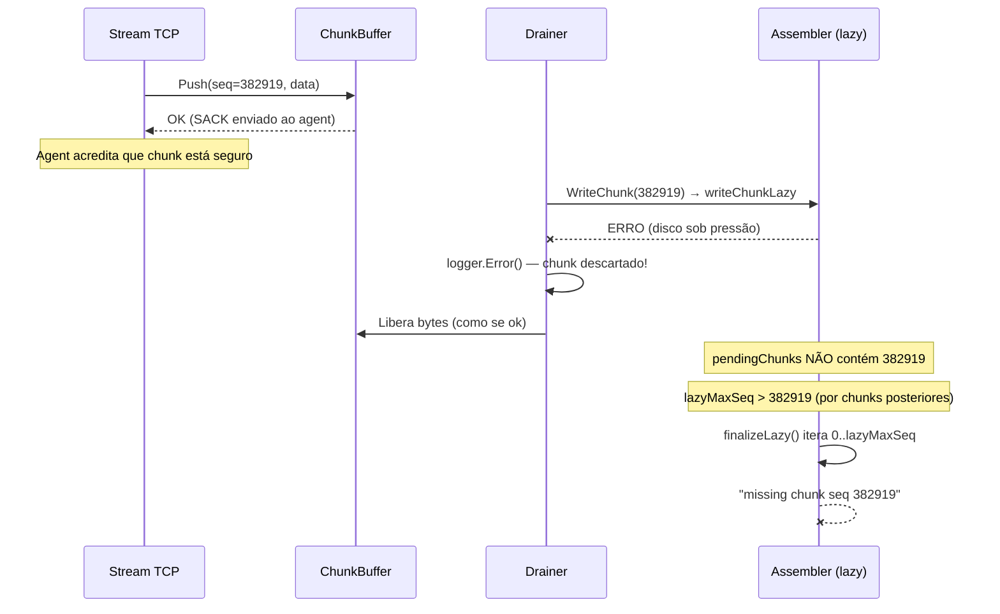
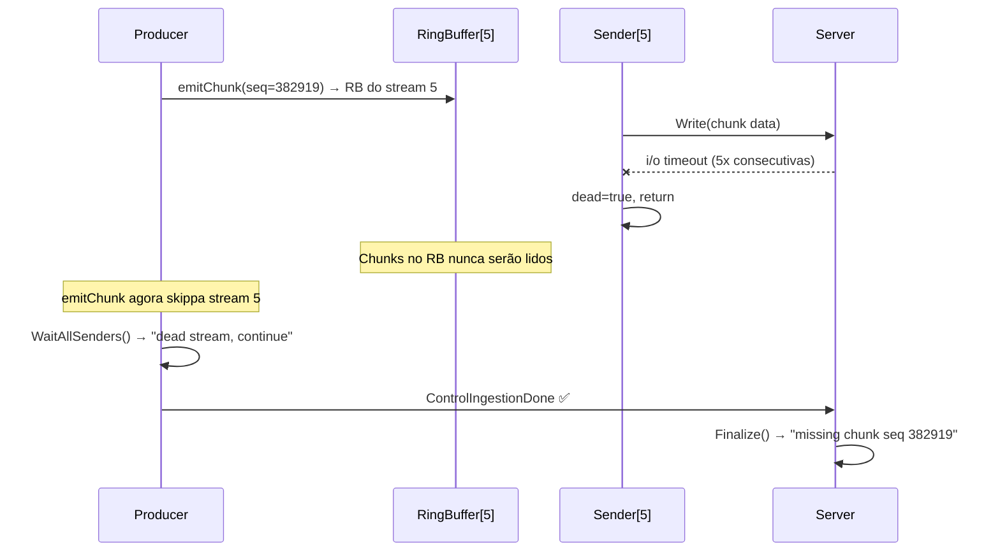

# Correção de Chunk Loss em Backup Paralelo

O backup do agent `popline-01` falhou com `missing chunk seq 382919 in lazy assembly` na v2.8.2. A investigação revelou 3 vetores de perda silenciosa de chunks que interagem entre si durante instabilidade de rede com reconexões massivas.

## User Review Required

> [!CAUTION]
> **Bug #1 é crítico**: chunks são descartados silenciosamente pelo `drainSlot()`, causando corrupção de backup sem nenhum erro visível na sessão. O backup só falha na finalização, horas depois.

> [!IMPORTANT]
> **Bug #2** (dead streams) pode não ter ocorrido neste caso específico (os logs mostram reconexões bem-sucedidas), mas é um risco real com rede mais degradada. Sugiro corrigir preventivamente ou posso deixar para um segundo momento — qual sua preferência?

---

## Análise dos 3 Vetores de Chunk Loss

### Vetor #1: `drainSlot()` engole erros de `WriteChunk`



### Vetor #2: Dead streams com dados no ring buffer



### Vetor #3: Reconexão + ChunkBuffer = SACK confirma antes da persistência

No fluxo atual:
1. Server recebe chunk do TCP
2. Push ao `ChunkBuffer` (memória) → **SACK enviado ao agent** 
3. Agent avança offset → **nunca re-envia este chunk**
4. `drainSlot` tenta persistir → **falha** (Vetor #1)
5. Na reconexão, `lastOffset` já inclui o chunk → **agent não sabe que foi perdido**

---

## Proposed Changes

### ChunkBuffer — Fix do `drainSlot` e mecanismo de abort de sessão

#### [MODIFY] [chunkbuffer.go](file:///home/lucas/Projects/n-backup/internal/server/chunkbuffer.go)

**1. Adicionar mecanismo de sessão falhada:**
- Novo campo `failedSessions sync.Map` (key: `*ChunkAssembler`, value: `error`) 
- Quando `drainSlot` falha ao chamar `WriteChunk`, registrar a sessão como **falhada** em vez de descartar silenciosamente
- Retry interno com backoff limitado (3 tentativas) antes de marcar como falhada

**2. Modificar `drainSlot`:**

```diff
 func (cb *ChunkBuffer) drainSlot(slot chunkSlot) {
     dataLen := int64(len(slot.data))
-    if err := slot.assembler.WriteChunk(slot.globalSeq, bytes.NewReader(slot.data), dataLen); err != nil {
-        cb.logger.Error("chunk buffer drain error", ...)
+    var lastErr error
+    for attempt := 0; attempt < 3; attempt++ {
+        if err := slot.assembler.WriteChunk(slot.globalSeq, bytes.NewReader(slot.data), dataLen); err != nil {
+            lastErr = err
+            cb.logger.Warn("chunk buffer drain retry",
+                "globalSeq", slot.globalSeq, "attempt", attempt+1, "error", err)
+            time.Sleep(100 * time.Millisecond * time.Duration(1<<attempt))
+            continue
+        }
+        lastErr = nil
+        break
+    }
+    if lastErr != nil {
+        cb.logger.Error("chunk buffer drain FAILED permanently — session will be aborted",
+            "globalSeq", slot.globalSeq, "error", lastErr)
+        cb.failedSessions.Store(slot.assembler, lastErr)
     }
     cb.inFlightBytes.Add(-dataLen)
     cb.getSessionCounter(slot.assembler).Add(-dataLen)
     cb.totalDrained.Add(1)
 }
```

**3. Novo método `SessionFailed`:**

```go
func (cb *ChunkBuffer) SessionFailed(assembler *ChunkAssembler) error {
    if cb == nil {
        return nil
    }
    if v, ok := cb.failedSessions.Load(assembler); ok {
        return v.(error)
    }
    return nil
}
```

---

#### [MODIFY] [handler.go](file:///home/lucas/Projects/n-backup/internal/server/handler.go)

**4. Verificar sessão falhada antes de Finalize:**

Na função `handleParallelBackup`, após o `Flush()` e antes de `Finalize()`:

```diff
     if h.chunkBuffer != nil {
         if err := h.chunkBuffer.Flush(assembler); err != nil {
             ...
         }
+        // Verifica se algum chunk falhou permanentemente durante a drenagem.
+        if err := h.chunkBuffer.SessionFailed(assembler); err != nil {
+            logger.Error("session aborted: chunk buffer drain failure", "error", err)
+            protocol.WriteFinalACK(conn, protocol.FinalStatusWriteError)
+            if h.Events != nil {
+                h.Events.PushEvent("error", "drain_failure", agentName,
+                    fmt.Sprintf("%s/%s chunk drain failed: %v", storageName, backupName, err), 0)
+            }
+            return
+        }
     }
```

---

### Dispatcher — Dead streams devem abortar o backup

#### [MODIFY] [dispatcher.go](file:///home/lucas/Projects/n-backup/internal/agent/dispatcher.go)

**5. `WaitAllSenders` deve retornar erro se algum stream morreu:**

Streams mortos = chunks perdidos no ring buffer. O backup deve falhar explicitamente.

```diff
 func (d *Dispatcher) WaitAllSenders(ctx context.Context) error {
     done := make(chan error, 1)
     go func() {
+        var deadErr error
         for i := 0; i < d.maxStreams; i++ {
             if d.streams[i].active.Load() || d.streams[i].dead.Load() {
                 if err := d.WaitSender(i); err != nil {
                     if d.streams[i].dead.Load() {
                         d.logger.Warn("dead stream sender finished with error",
                             "stream", i, "error", err)
-                        continue
+                        if deadErr == nil {
+                            deadErr = fmt.Errorf("stream %d died with unsent data: %w", i, err)
+                        }
+                        continue
                     }
                     done <- fmt.Errorf("stream %d sender error: %w", i, err)
                     return
                 }
             }
         }
-        done <- nil
+        done <- deadErr
     }()
```

---

## Verification Plan

### Automated Tests

**Teste 1: `drainSlot` com falha de `WriteChunk`**

Arquivo: `chunkbuffer_test.go` → Novo teste `TestChunkBuffer_DrainSlot_WriteChunkFailure`
- Cria `ChunkAssembler` com `syncFile` mockado para falhar
- Faz Push de um chunk
- Aguarda drain
- Verifica que `SessionFailed()` retorna erro não-nil
- Verifica que o chunk NÃO está no assembler

**Teste 2: `drainSlot` com retry bem-sucedido**

Arquivo: `chunkbuffer_test.go` → Novo teste `TestChunkBuffer_DrainSlot_RetrySuccess`
- Faz `syncFile` falhar na 1ª tentativa e suceder na 2ª
- Verifica que o chunk É persistido após retry
- Verifica que `SessionFailed()` retorna nil

**Teste 3: `SessionFailed` check no handler flow**

Validado indiretamente pelo Teste 1 + verificação manual.

**Teste 4: `WaitAllSenders` com dead stream**

Arquivo: `dispatcher_test.go` → Verificar teste existente `TestDispatcher_WaitAllSendersContext` e adicionar caso onde stream morre.

**Comandos de execução:**

```bash
# Testes unitários com race detector
go test ./internal/server/... -race -run "TestChunkBuffer_DrainSlot" -v -count=1

# Testes do dispatcher
go test ./internal/agent/... -race -run "TestDispatcher_WaitAllSenders" -v -count=1

# Suite completa com race detector
go test ./... -race -count=1 -timeout 120s

# Build limpo
go build ./...
```

### Manual Verification

Não aplicável — as correções são validáveis integralmente por testes automatizados.
