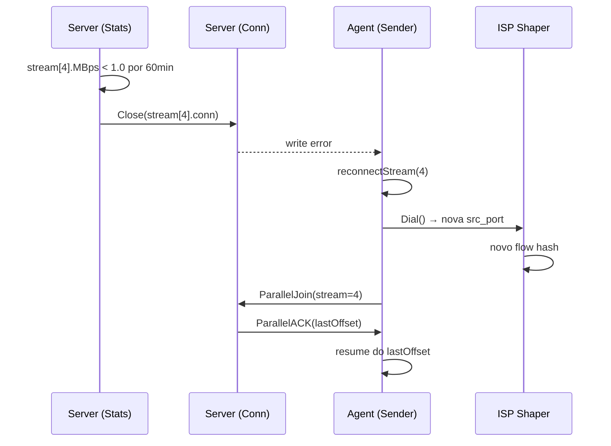

# DSCP + Flow Rotation + Diagnóstico Producer/Consumer

Mitigar traffic shaping per-flow de ISPs e fornecer instrumentação para diagnóstico de gargalos.

**3 features complementares:**
1. **DSCP**: marca pacotes para entrar em filas QoS melhores (configurável, default off)
2. **Flow Rotation**: server detecta streams degradados e força reconexão (novo flow)
3. **Diagnóstico**: identifica se o gargalo é no producer (tar.gz) ou no consumer (rede/TCP)

---

## Arquitetura do Flow Rotation

O server já mede throughput per-stream via `StreamTrafficIn`. A cada tick do stats reporter (15s), calcula MBps. Se um stream fica abaixo do threshold por tempo contínuo, o server fecha a conn daquele stream — o agent detecta o erro de write e reconecta via `reconnectStream` (nova source port → novo flow).

> [!IMPORTANT]
> A conn primária está bloqueada em `StreamWg.Wait()` durante o backup. A abordagem é fechar diretamente a conn do stream degradado — o agent já tem retry/reconnect nativo. Nenhuma mudança no protocolo necessária.



## Arquitetura do Diagnóstico Producer/Consumer

O pipeline producer → ring buffer → sender/TCP funciona como um sistema producer-consumer. Medindo **quando cada lado bloqueia**, identificamos o gargalo:

| Ring buffer | Gargalo | Significado |
|-------------|---------|-------------|
| Sempre cheio (producer bloqueado) | **Rede/TCP** | tar.gz produz rápido, TCP não drena |
| Sempre vazio (sender bloqueado) | **Producer** | tar.gz lento, senders ociosos |
| Oscilando | Equilibrado | Ambos na mesma velocidade |

Instrumentação: dois contadores atômicos no `Dispatcher`:
- `producerBlockedNs` — acumulado de tempo bloqueado no `rb.Write` (ring buffer cheio)
- `senderIdleNs` — acumulado de tempo bloqueado no `rb.ReadAt` (ring buffer vazio)

O stats reporter já existente calcula a % de tempo bloqueado de cada lado a cada intervalo.

---

## Proposed Changes

### Config

#### [MODIFY] [agent.go](file:///home/lucas/Projects/n-backup/internal/config/agent.go)

- Adicionar campo `DSCP string` ao `BackupEntry` (`yaml:"dscp"`, default `""` = off)
  - Valores válidos: `"EF"`, `"AF41"`, `"AF31"`, `"AF21"`, `"CS1"`, etc.
- Validar no `validate()` via mapa name→value

#### [MODIFY] [server.go](file:///home/lucas/Projects/n-backup/internal/config/server.go)

- Adicionar struct `FlowRotation` ao `ServerConfig`:
  ```yaml
  flow_rotation:
    enabled: false       # default
    min_mbps: 1.0        # threshold MB/s
    eval_window: 60m     # janela de avaliação
    cooldown: 15m        # cooldown entre rotações
  ```

---

### Agent — DSCP

#### [NEW] [dscp.go](file:///home/lucas/Projects/n-backup/internal/agent/dscp.go)

- Mapa DSCP: `{"EF": 46, "AF41": 34, "AF31": 26, "CS1": 8, ...}`
- `ParseDSCP(name string) (int, error)`
- `ApplyDSCP(conn net.Conn, dscp int) error` — usa `SyscallConn().Control()` + `IP_TOS`

#### [MODIFY] [dispatcher.go](file:///home/lucas/Projects/n-backup/internal/agent/dispatcher.go)

- Adicionar `DSCPValue int` ao `DispatcherConfig`
- Chamar `ApplyDSCP()` no `ActivateStream` e `reconnectStream` após o `Dial`

---

### Agent — Diagnóstico Producer/Consumer

#### [MODIFY] [dispatcher.go](file:///home/lucas/Projects/n-backup/internal/agent/dispatcher.go)

- Adicionar ao `Dispatcher`:
  ```go
  producerBlockedNs atomic.Int64  // tempo bloqueado em rb.Write (buffer cheio)
  senderIdleNs      atomic.Int64  // tempo bloqueado em rb.ReadAt (buffer vazio)
  ```

- Em `emitChunk()` — medir tempo de `stream.rb.Write()`:
  ```go
  start := time.Now()
  _, err := stream.rb.Write(data)
  if elapsed := time.Since(start); elapsed > 1*time.Millisecond {
      d.producerBlockedNs.Add(elapsed.Nanoseconds())
  }
  ```

- Em `startSenderWithRetry()` — medir tempo de `stream.rb.ReadAt()`:
  ```go
  start := time.Now()
  n, err := stream.rb.ReadAt(offset, buf)
  if elapsed := time.Since(start); elapsed > 1*time.Millisecond {
      d.senderIdleNs.Add(elapsed.Nanoseconds())
  }
  ```

- Adicionar ao `SampleRates()` → `RateSample`:
  ```go
  type RateSample struct {
      ProducerBps       float64
      DrainBps          float64
      ProducerBlockedMs int64   // ms bloqueado no intervalo
      SenderIdleMs      int64   // ms ocioso no intervalo
  }
  ```

#### [MODIFY] [stats_reporter.go](file:///home/lucas/Projects/n-backup/internal/agent/stats_reporter.go)

- Logar as novas métricas no relatório:
  ```json
  {"producer_blocked_ms": 12500, "sender_idle_ms": 200, "bottleneck": "network"}
  ```
- Se `producer_blocked_ms > sender_idle_ms` → `bottleneck: "network"`
- Se `sender_idle_ms > producer_blocked_ms` → `bottleneck: "producer"`

---

### Server — Flow Rotation

#### [MODIFY] [handler.go](file:///home/lucas/Projects/n-backup/internal/server/handler.go)

- Adicionar ao `ParallelSession`:
  ```go
  StreamSlowSince sync.Map // streamIndex → time.Time
  StreamLastReset sync.Map // streamIndex → time.Time
  ```

- Novo método `evaluateFlowRotation(intervalSecs float64)` chamado pelo stats reporter quando `flow_rotation.enabled`:
  1. Itera `StreamTrafficIn`, calcula MBps
  2. MBps < threshold → registra `StreamSlowSince[idx]`
  3. Se `time.Since(SlowSince) >= eval_window` E `time.Since(LastReset) >= cooldown`:
     - Fecha `StreamConns[idx]` → agent detecta e reconecta
     - Registra `StreamLastReset[idx]`
     - Log `"flow rotation triggered"`
  4. MBps >= threshold → limpa `StreamSlowSince[idx]`

---

## Verification Plan

### Automated Tests

- `TestParseDSCP` — parsing de nomes DSCP válidos e inválidos
- `TestApplyDSCP` — set de TOS via SyscallConn
- `TestFlowRotation_Trigger` — simula throughput baixo, verifica conn fechada após eval_window
- `TestFlowRotation_Cooldown` — garante que não reseta dentro do cooldown
- `TestFlowRotation_Recovery` — threshold atingido, SlowSince limpo
- `TestDiagnostic_ProducerBlocked` — buffer cheio, producerBlockedNs incrementa
- `TestDiagnostic_SenderIdle` — buffer vazio, senderIdleNs incrementa
- `go test ./...` sem regressão

### Manual Verification

- DSCP: `tcpdump -v` para verificar campo TOS
- Flow Rotation: monitorar logs `"flow rotation triggered"` + agent reconecta com nova source port
- Diagnóstico: em ambiente real, observar `bottleneck` no stats reporter
