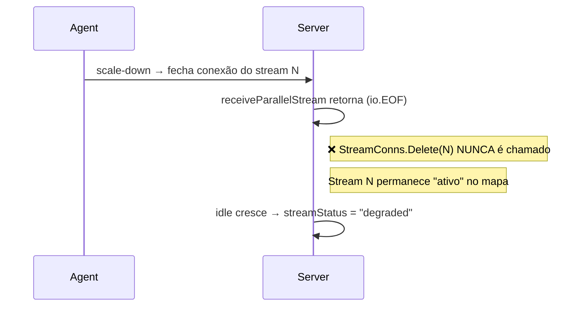

# Fix: Stream Status "degraded" → "disconnected" Após Scale-Down do Autoscaler

## Problema

Quando o AutoScaler do agent reduz streams (scale-down), fecha a conexão TCP. No server, a goroutine `receiveParallelStream` termina mas **nunca remove o stream de `StreamConns`**. O stream permanece no mapa com conexão morta, o idle cresce indefinidamente e `streamStatus()` retorna `"degraded"` ao invés de `"disconnected"`.

## Causa Raiz

Em [handleParallelJoin](file:///home/lucas/Projects/n-backup/internal/server/handler.go#L2088-L2103), após `receiveParallelStream` retornar (stream encerrou normalmente), não há limpeza de `StreamConns.Delete(idx)`. O mapa `StreamConns` é usado em `SessionDetail()` para determinar quais streams estão "ativos", e a `streamStatus()` recebe `active=true` para um stream morto.



## Proposed Changes

### Server Handler

#### [MODIFY] [handler.go](file:///home/lucas/Projects/n-backup/internal/server/handler.go)

**1. Limpar `StreamConns` no fim de `handleParallelJoin`** (linhas ~2088-2103):

Após `receiveParallelStream` retornar sem ser por re-join (`streamCtx.Err() != context.Canceled`), fazer `StreamConns.Delete(pj.StreamIndex)` para que o stream seja corretamente marcado como inativo.

```diff
 	bytesReceived, err := h.receiveParallelStream(streamCtx, conn, conn, conn, pj.StreamIndex, pSession, logger)
 	pSession.StreamWg.Done()
 
 	if err != nil {
 		if ctx.Err() == nil && streamCtx.Err() == context.Canceled {
 			logger.Info("parallel stream replaced by re-join", "bytes", bytesReceived)
 			return
 		}
 		logger.Error("receiving parallel stream", "error", err, "bytes", bytesReceived)
-		return
+		pSession.StreamConns.Delete(pj.StreamIndex)
+		return
 	}
 
+	pSession.StreamConns.Delete(pj.StreamIndex)
 	logger.Info("parallel stream complete", "bytes", bytesReceived)
```

> [!IMPORTANT]
> O `Delete` NÃO deve acontecer no caso de re-join (quando `streamCtx.Err() == context.Canceled`), pois o novo join já fez `StreamConns.Store` com a nova conexão.

**2. Ajustar `streamStatus()` — "degraded" com idle alto em stream inativo → "disconnected"** (linhas ~582-602):

Atualmente, quando `!active`, retorna `"inactive"`. Isso é adequado para streams que nunca existiram ou foram desabilitados. Mas para streams que já tiveram conexão (têm offset > 0), o status mais semântico é `"disconnected"`. Entretanto, a função `streamStatus` não tem acesso ao offset. A abordagem mais limpa é: a combinação `!active` (sem mais StreamConns) + idle alto já é coberta — streams sem entrada no `StreamConns` após o `Delete` receberão `active=false` e o `streamStatus()` retorna `"inactive"`. Isso é funcional mas não distingue entre "nunca conectou" e "desconectou". 

Proposta: renomear o retorno de `"inactive"` para `"disconnected"` na funação `streamStatus` quando `!active`, já que na prática no código atual todo stream listado já conectou pelo menos uma vez (a iteração é sobre `StreamOffsets`, que só é populado no join).

```diff
 func streamStatus(active bool, idleSecs int64, slowSince string, evalWindow time.Duration) string {
 	if !active {
-		return "inactive"
+		return "disconnected"
 	}
```

### Frontend CSS

#### [MODIFY] [style.css](file:///home/lucas/Projects/n-backup/internal/server/observability/web/css/style.css)

Adicionar estilo de badge para `disconnected` (reutilizando o visual de `inactive` com tom neutro):

```css
.badge-disconnected {
    background: rgba(148, 163, 184, 0.2);
    color: var(--text-muted);
}
```

### DTO

#### [MODIFY] [dto.go](file:///home/lucas/Projects/n-backup/internal/server/observability/dto.go)

Atualizar o comentário do campo `Status` em `StreamDetail`:

```diff
-	Status       string  `json:"status"`                  // running | idle | slow | degraded | inactive
+	Status       string  `json:"status"`                  // running | idle | slow | degraded | disconnected
```

## Verification Plan

### Automated Tests

Comando para rodar os testes do server:

```bash
cd /home/lucas/Projects/n-backup && go test ./internal/server/... -v -run TestStreamStatus
```

Adicionar o teste `TestStreamStatus_DisconnectedAfterScaleDown` ao arquivo [handler_flow_rotation_test.go](file:///home/lucas/Projects/n-backup/internal/server/handler_flow_rotation_test.go) que valida:
1. Stream com `active=false` → status `"disconnected"`
2. Stream com `active=true` e idle < 10s → status `"running"`
3. Stream com `active=true` e idle > 60s → status `"degraded"`

Rodar testes existentes para garantir não-regressão:

```bash
cd /home/lucas/Projects/n-backup && go test ./internal/server/... -v
```

### Manual Verification

Deploy e execução de backup com múltiplos streams para que o autoscaler faça scale-down, e verificar na WebUI que o stream desativado aparece como `disconnected` ao invés de `degraded`.
